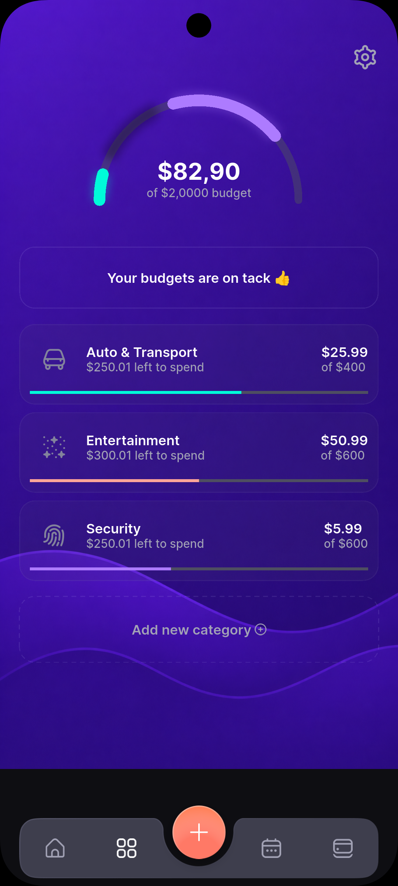

# Expenny 💸

A modern Flutter-based Expense Tracker and Subscription Management application designed to help users monitor recurring subscriptions, manage budgets, track upcoming bills, and visualize spending habits through an elegant UI.

## 📱 Screenshots

### Welcome Screen


### Social Login


### Sign In


### Dashboard


### Budget Tracking



### Calendar View


### Credit Cards


---

## ✨ Features

* Beautiful modern UI
* Subscription management
* Expense tracking
* Budget planning
* Upcoming bills overview
* Calendar-based expense visualization
* Credit card management interface
* Responsive design
* Custom widgets and reusable components

---

## 🛠️ Tech Stack

### Frontend

* Flutter
* Dart
* Material Design

### Planned Backend

* Node.js
* Express.js
* MongoDB
* JWT Authentication

### Planned Architecture Improvements

* Clean Architecture
* BLoC / Cubit State Management
* Dependency Injection
* Repository Pattern
* Modular Architecture

---

## 📂 Project Structure

```text
lib/
├── common/
├── common_widget/
├── view/
│   ├── add_subscription/
│   ├── calender/
│   ├── card/
│   ├── home/
│   ├── login/
│   ├── main_tab/
│   ├── settings/
│   ├── spending_budgets/
│   └── subscription_info/
└── main.dart
```

---

## 🚀 Getting Started

### Prerequisites

* Flutter SDK
* Android Studio
* Android SDK
* Git

### Installation

Clone the repository:

```bash
git clone https://github.com/Art0citus/Expenny.git
```

Move into project directory:

```bash
cd Expenny
```

Install dependencies:

```bash
flutter pub get
```

Run the application:

```bash
flutter run
```

---

## 🎯 Future Roadmap

* User Authentication
* Google Sign-In
* Backend Integration
* Cloud Database Synchronization
* Push Notifications
* Expense Analytics
* Dark/Light Theme Support
* AI-powered Expense Insights

---

## 📄 License

This project is open source and available under the MIT License.
